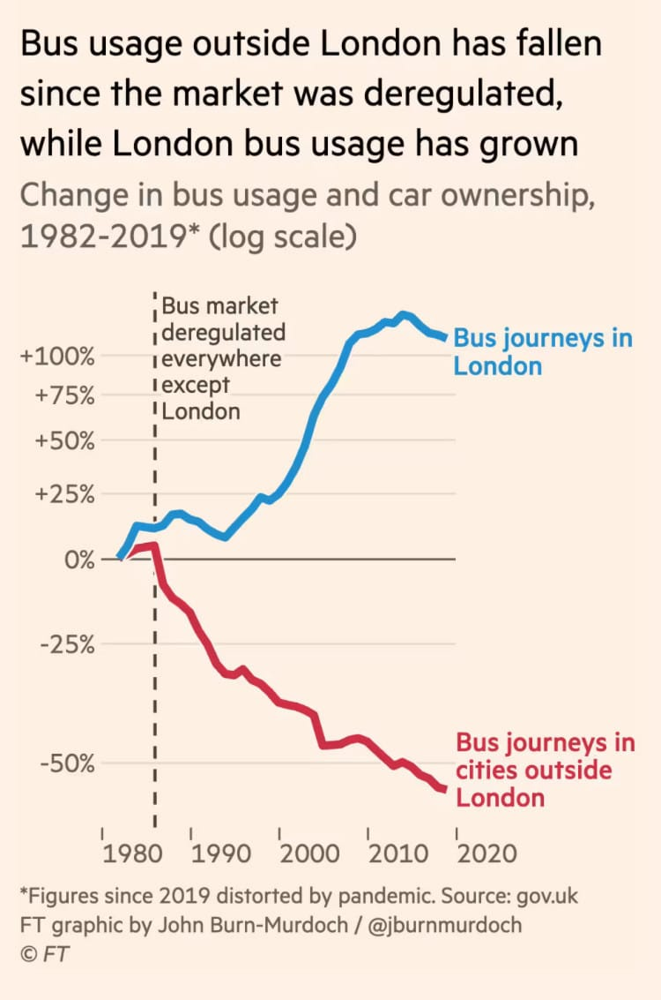
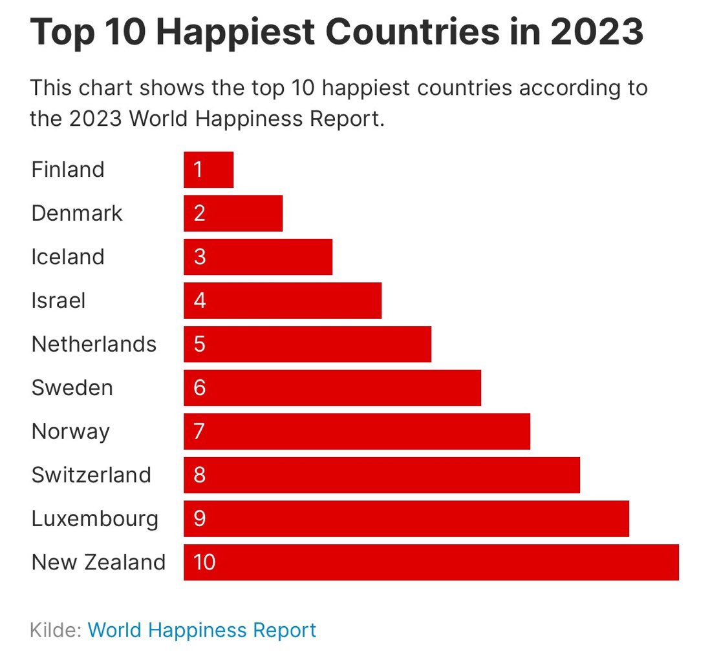
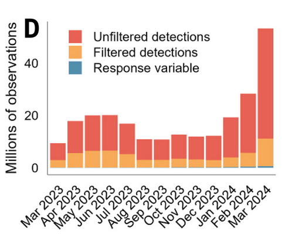
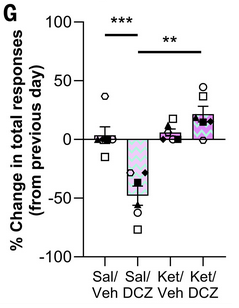

```{r setup, include=FALSE}
knitr::opts_chunk$set(echo = TRUE, results = "hide", fig.show = "hide")
library(ggplot2)
```

```{=html}
<script>
/* --- answer lock --- */
var WS_PASS_SHA256 = '324a529408a7e7e4be5510c0fc0cbac4049a0606594beaadc7b559df76281cdb';
var WS_PASS_DJB2   = 'ffa97e12';
var _wsUnlocked = false;

function _wsDjb2(s) {
  var h = 5381;
  for (var i = 0; i < s.length; i++) { h = ((h << 5) + h + s.charCodeAt(i)) | 0; }
  return (h >>> 0).toString(16).padStart(8, '0');
}
function wsVerifyPass() {
  var inp = document.getElementById('ws-pass-input'); if (!inp) return;
  var msg = document.getElementById('ws-pass-msg');
  function finish(ok) {
    if (ok) {
      _wsUnlocked = true; sessionStorage.setItem('ws-unlocked', WS_PASS_SHA256);
      document.body.classList.remove('ws-locked');
      var b = document.getElementById('ws-lock-banner');
      if (b) { b.style.transition = 'opacity 0.4s'; b.style.opacity = '0'; setTimeout(function () { b.remove(); }, 450); }
    } else {
      inp.classList.add('ws-wrong'); if (msg) msg.textContent = 'Incorrect password.';
      setTimeout(function () { inp.classList.remove('ws-wrong'); if (msg) msg.textContent = ''; }, 2000);
    }
  }
  if (window.crypto && crypto.subtle) {
    crypto.subtle.digest('SHA-256', new TextEncoder().encode(inp.value))
      .then(function (buf) { var hex = Array.from(new Uint8Array(buf)).map(function (b) { return b.toString(16).padStart(2, '0'); }).join(''); finish(hex === WS_PASS_SHA256); })
      .catch(function () { finish(_wsDjb2(inp.value) === WS_PASS_DJB2); });
  } else { finish(_wsDjb2(inp.value) === WS_PASS_DJB2); }
}
function wsFlashBanner() {
  var b = document.getElementById('ws-lock-banner'); if (!b) return;
  b.classList.remove('ws-flash'); void b.offsetWidth; b.classList.add('ws-flash');
}
function wsInitLock() {
  if (sessionStorage.getItem('ws-unlocked') === WS_PASS_SHA256) { _wsUnlocked = true; return; }
  document.body.classList.add('ws-locked');
  var b = document.createElement('div'); b.id = 'ws-lock-banner';
  b.innerHTML = '<span style="font-size:1.15rem;line-height:1;">🔒</span>' +
    '<span>Answers are locked. Enter the workshop password to reveal them.</span>' +
    '<span class="ws-unlock-form">' +
      '<input type="password" id="ws-pass-input" placeholder="Password"' +
      ' onkeydown="if(event.key===\'Enter\')wsVerifyPass();">' +
      '<button id="ws-unlock-btn" onclick="wsVerifyPass()">Unlock</button>' +
    '</span><span id="ws-pass-msg"></span>';
  var t = document.getElementById('title-block-header');
  if (t) t.insertAdjacentElement('afterend', b); else document.body.prepend(b);
}
document.addEventListener('DOMContentLoaded', wsInitLock);
/* --- end lock --- */

function revealAnswer(btn) {
  if (!_wsUnlocked) { wsFlashBanner(); return; }
  var block = btn.closest('.question-block, .puzzle-block');
  var answerClass = block.classList.contains('puzzle-block') ? '.puzzle-answer' : '.instructor-answer';

  // Free-text gate
  var textarea = block.querySelector('.student-answer');
  if (textarea) {
    if (textarea.value.trim() === '') {
      textarea.classList.add('missing');
      textarea.placeholder = 'Please write your answer before revealing...';
      textarea.focus();
      return;
    }
    textarea.classList.remove('missing');
  }

  // Multiple-choice gate
  var mcOptions = block.querySelector('.mc-options');
  if (mcOptions) {
    var radios = mcOptions.querySelectorAll('input[type=radio]');
    var anyChecked = Array.from(radios).some(function(r) { return r.checked; });
    if (!anyChecked) {
      mcOptions.classList.add('unanswered');
      return;
    }
    mcOptions.classList.remove('unanswered');
    radios.forEach(function(r) {
      r.disabled = true;
      var label = r.closest('label');
      if (r.dataset.correct === 'true') {
        label.classList.add('mc-correct');
      } else if (r.checked) {
        label.classList.add('mc-incorrect');
      }
    });
  }

  var answer = block.querySelector(answerClass);
  if (answer) answer.style.display = 'block';
  btn.textContent = 'Answer shown';
  btn.disabled = true;
}

function toggleGlossary() {
  document.getElementById('glossary-panel').classList.toggle('open');
}
</script>
```

```{=html}
<style>
#glossary-btn {
  position: fixed;
  bottom: 2rem;
  right: 2rem;
  background: #00b494;
  color: #fff;
  border: none;
  padding: 0.55rem 1.1rem;
  border-radius: 4px;
  cursor: pointer;
  font-size: 0.875rem;
  font-weight: 600;
  z-index: 1000;
  box-shadow: 0 2px 8px rgba(0,0,0,0.25);
  transition: background 0.15s;
  font-family: inherit;
}
#glossary-btn:hover { background: #009478; }

#glossary-panel {
  position: fixed;
  top: 0;
  right: -400px;
  width: 380px;
  height: 100vh;
  background: #fff;
  border-left: 3px solid #00b494;
  box-shadow: -4px 0 20px rgba(0,0,0,0.15);
  z-index: 1001;
  transition: right 0.3s ease;
  display: flex;
  flex-direction: column;
}
#glossary-panel.open { right: 0; }

#glossary-header {
  background: #0d1e2c;
  color: #fff;
  padding: 1rem 1.25rem;
  display: flex;
  justify-content: space-between;
  align-items: center;
  flex-shrink: 0;
}
#glossary-header span {
  font-weight: 600;
  font-size: 0.95rem;
  letter-spacing: 0.03em;
}
#glossary-close {
  background: none;
  border: none;
  color: #fff;
  font-size: 1.3rem;
  cursor: pointer;
  padding: 0;
  line-height: 1;
  opacity: 0.7;
}
#glossary-close:hover { opacity: 1; }

#glossary-body {
  overflow-y: auto;
  flex: 1;
}

.glossary-entry {
  padding: 0.85rem 1.25rem;
  border-bottom: 1px solid #e8f5f0;
}
.glossary-entry:last-child { border-bottom: none; }

.glossary-terms {
  display: flex;
  align-items: baseline;
  gap: 0.5rem;
  flex-wrap: wrap;
  margin-bottom: 0.3rem;
}
.glossary-en-term {
  font-weight: 600;
  color: #0d1e2c;
  font-size: 0.92rem;
}
.glossary-zh-term {
  color: #00b494;
  font-weight: 600;
  font-size: 0.92rem;
}
.glossary-en-def {
  font-size: 0.845rem;
  color: #444;
  line-height: 1.5;
  margin-bottom: 0.25rem;
}
.glossary-zh-def {
  font-size: 0.845rem;
  color: #1c3a50;
  line-height: 1.65;
}
</style>
```

::: {.callout-note}
## Workshop structure

These workshops follow an analytical workflow. Today we focus on steps 2 and 3, expanding the toolkit you built in Workshop 1 using data visualisation.

1. Formulate a research question.
2. Perform exploratory data analysis **[Focus of today]**.
3. Identify any hidden assumptions **[Focus of today]**.
4. Fit an appropriate model.
5. Diagnose the model and check assumptions.
6. Summarise the results.
7. Interpret and provide inferences.
:::

::: {.callout-tip}
## Learning objectives

1. Use the `R` package `ggplot2` to produce data visualisations.
2. Distinguish effective visualisations from ineffective ones.
3. Apply some techniques to make figures more visually appealing.

These skills come up throughout the course and beyond.
:::

# Introduction to `ggplot2`

`ggplot2` implements the "Grammar of Graphics": a framework for building plots layer by layer. You start with a dataset, map variables to visual properties (called aesthetics) using `aes()`, then add one or more geometry functions that determine the form of the plot (points, lines, bars, and so on). Scales, labels, and themes refine the result. The approach is flexible enough to produce sophisticated figures with surprisingly little code. Familiarity with `ggplot2` is increasingly expected by employers; Spotify has listed it as an essential criterion in job adverts.

That said, `ggplot2` is not the only option. Base R can produce similar plots, and many of the figures in this course could be recreated that way. We use `ggplot2` because we find it more intuitive, and nearly every figure you see on this course was produced with it.

## Load the data

For the first part of this workshop we'll use data on the Amazon river dolphin, or boto (*Inia geoffrensis*). We're broadly interested in two questions: is there sexual dimorphism in asymptotic length (the length animals reach once they stop growing), and how does the species respond to drought? As always, check for anything unusual before starting any analysis.

> R sessions sometimes reopen with objects from a previous session, because you clicked "Save workspace" on exit. Leftover objects can cause confusion. Clear your environment before starting with:
>
> `rm(list = ls())`
>
> This removes all objects in the global environment but does not delete any files. In RStudio, you can do the same from the Environment pane by clicking the broom icon.

Download `boto.txt` from today's workshop folder on MyAberdeen. Open a new script, set your working directory, and load the data:

```{r, eval=FALSE}
setwd("H:/BI3010/workshop2")
boto <- read.table("boto.txt", header = TRUE)
```

Run a quick `summary()` and `str()` to check for anything unexpected:

```{r, eval=FALSE}
summary(boto)
str(boto)
```

## Building a first plot

Install and load `ggplot2` if you haven't already:

```{r, eval=FALSE}
install.packages("ggplot2")  # Run once
library(ggplot2)
```

Call `ggplot()` with no arguments, then with the dataset:

```{r, eval=FALSE}
ggplot()     # Empty canvas — expected
ggplot(boto) # Still empty — we haven't said what to plot or how
```

The canvas stays empty because we haven't told `ggplot2` two things: (1) which form to show the data in and (2) which variables to map to which axes. Let's put `length` on the y-axis, `drought` on the x-axis, and show the data as points:

```{r, eval=FALSE}
ggplot(boto) +
  geom_point(aes(y = length, x = drought))
```

From this plot and the summary statistics, we can already start drawing conclusions.

## First impressions

<div class="question-block">
<p><strong>Question 1.</strong> What variables are available in this dataset?</p>
<textarea class="student-answer" rows="2" placeholder="Write your answer here..."></textarea>
<button class="reveal-btn" onclick="revealAnswer(this)">Show Answer</button>
<div class="instructor-answer">
<p>Three variables: <code>sex</code>, <code>drought</code>, and <code>length</code>.</p>
</div>
</div>

<div class="question-block">
<p><strong>Question 2.</strong> How many observations does the dataset contain?</p>
<textarea class="student-answer" rows="2" placeholder="Write your answer here..."></textarea>
<button class="reveal-btn" onclick="revealAnswer(this)">Show Answer</button>
<div class="instructor-answer">
<p>71 boto dolphins.</p>
</div>
</div>

<div class="question-block">
<p><strong>Question 3.</strong> Based on the scatterplot, is the relationship between boto length and number of drought years positive, neutral, or negative?</p>
<textarea class="student-answer" rows="2" placeholder="Write your answer here..."></textarea>
<button class="reveal-btn" onclick="revealAnswer(this)">Show Answer</button>
<div class="instructor-answer">
<p>Very likely negative: longer drought histories appear to correspond to shorter dolphins.</p>
</div>
</div>

<div class="question-block">
<p><strong>Question 4.</strong> What range of lengths do boto dolphins reach at maturity?</p>
<textarea class="student-answer" rows="2" placeholder="Write your answer here..."></textarea>
<button class="reveal-btn" onclick="revealAnswer(this)">Show Answer</button>
<div class="instructor-answer">
<p>From <code>summary()</code>: roughly 170 to 238 cm. The scatterplot gives the same impression.</p>
</div>
</div>

# Additional `geom_` layers

How do we include a categorical variable like `sex`? Swapping `drought` for `sex` on the x-axis is a start:

```{r, eval=FALSE}
ggplot(boto) +
  geom_point(aes(y = length, x = sex))
```

The spread of data for each sex is hard to read as a single column of stacked points. Boxplots and violin plots handle this better. Changing the plot type is as simple as replacing the geometry function:

```{r, eval=FALSE}
# Boxplot
ggplot(boto) +
  geom_boxplot(aes(y = length, x = sex))

# Violin plot
ggplot(boto) +
  geom_violin(aes(y = length, x = sex))
```

Boxplots use the median and interquartile range to summarise the distribution. Violin plots show the full distribution as a smoothed density curve, mirrored symmetrically. Boxplots have a long history in science, but violin plots are increasingly preferred because they reveal the shape of the distribution more directly.

It's also common to overlay raw data points on top of either. Using `geom_point()` would just produce a column of stacked points again, so we "jitter" them instead: add a small random offset to x so they spread horizontally. We don't want to jitter y (that would distort the length values), so we set `height = 0`:

```{r, eval=FALSE}
ggplot(boto) +
  geom_violin(aes(y = length, x = sex)) +
  geom_jitter(aes(y = length, x = sex), height = 0, width = 0.1)
```

Two things to note. First, `geom_jitter()` comes after `geom_violin()`. Layers are drawn in order, so placing the violin last would cover the points. Second, `height = 0` and `width = 0.1` sit outside `aes()` because they are fixed values, not columns in the dataset. Anything that changes based on a variable in the data goes inside `aes()`; anything fixed goes outside it.

## Debugging ggplot2 code

The following code snippets contain errors that will either produce an error message or silently fail to do what was intended. Try to spot each problem before running the code.

<div class="puzzle-block">
<p><strong>Puzzle 1.</strong> What is wrong with this code?</p>
<pre><code class="language-r">ggplot(boto) +
  geom_jitter(aes(y = length, x = sex, height = 0, width = 0.1))</code></pre>
<textarea class="student-answer" rows="2" placeholder="Describe the error..."></textarea>
<button class="reveal-btn" onclick="revealAnswer(this)">Show Answer</button>
<div class="puzzle-answer">
<p>The code runs but produces a warning: "Ignoring unknown aesthetics: height and width". The arguments <code>height</code> and <code>width</code> are fixed values, not variables from the dataset, so they belong outside <code>aes()</code>.</p>
</div>
</div>

<div class="puzzle-block">
<p><strong>Puzzle 2.</strong> Find the error:</p>
<pre><code class="language-r">ggplot(boto) +
  geom_point(aes(x = length, x = drought))</code></pre>
<textarea class="student-answer" rows="2" placeholder="Describe the error..."></textarea>
<button class="reveal-btn" onclick="revealAnswer(this)">Show Answer</button>
<div class="puzzle-answer">
<p>Error: "formal argument 'x' matched by multiple actual arguments". Two variables are both mapped to <code>x</code>. One should be <code>y = drought</code>.</p>
</div>
</div>

<div class="puzzle-block">
<p><strong>Puzzle 3.</strong> Find the error:</p>
<pre><code class="language-r">ggplot(boto) +
  geom_point(aes(x = length y = drought))</code></pre>
<textarea class="student-answer" rows="2" placeholder="Describe the error..."></textarea>
<button class="reveal-btn" onclick="revealAnswer(this)">Show Answer</button>
<div class="puzzle-answer">
<p>Error: "unexpected symbol in: ... geom_point(aes(x = length y"". There is a missing comma between <code>x = length</code> and <code>y = drought</code>.</p>
</div>
</div>

<div class="question-block">
<p><strong>Question 4.</strong> How would you produce a histogram of boto lengths? (Hint: type <code>geom_</code> in your script and wait for RStudio's autocomplete, browse the <a href="https://ggplot2.tidyverse.org/reference/" target="_blank">ggplot2 reference</a>, or search online.)</p>
<textarea class="student-answer" rows="3" placeholder="Write your code here..."></textarea>
<button class="reveal-btn" onclick="revealAnswer(this)">Show Answer</button>
<div class="instructor-answer">
<pre><code class="language-r">ggplot(boto) +
  geom_histogram(aes(x = length))</code></pre>
</div>
</div>

<div class="question-block">
<p><strong>Question 5.</strong> From the boxplot, what features tell you how symmetrical the distribution is for each sex?</p>
<textarea class="student-answer" rows="3" placeholder="Write your answer here..."></textarea>
<button class="reveal-btn" onclick="revealAnswer(this)">Show Answer</button>
<div class="instructor-answer">
<p>The box spans the interquartile range (Q1 to Q3) and the line inside shows the median. If the median sits centrally in the box and the whiskers are roughly equal in length, the distribution is roughly symmetric. Here, females have a slightly longer upper whisker and males a slightly longer lower whisker, suggesting modest asymmetry in both groups, though the differences are small.</p>
</div>
</div>

<div class="question-block">
<p><strong>Question 6.</strong> What is the difference between the interquartile range shown in the boxplot and the range?</p>
<textarea class="student-answer" rows="3" placeholder="Write your answer here..."></textarea>
<button class="reveal-btn" onclick="revealAnswer(this)">Show Answer</button>
<div class="instructor-answer">
<p><strong>Interquartile range (IQR):</strong> the difference between the 75th and 25th percentiles, i.e. the width of the box. It describes the spread of the central 50% of observations.</p>
<p><strong>Range:</strong> the difference between the maximum and minimum values in the data.</p>
</div>
</div>

<div class="question-block">
<p><strong>Question 7.</strong> What is the difference between the interquartile range and variance?</p>
<textarea class="student-answer" rows="3" placeholder="Write your answer here..."></textarea>
<button class="reveal-btn" onclick="revealAnswer(this)">Show Answer</button>
<div class="instructor-answer">
<p>Both measure spread, but differently. The IQR captures how wide the central half of the data is, ignoring the extremes. Variance is calculated from all observations and reflects how far each value deviates from the mean on average. A dataset with extreme outliers can have a large variance but a modest IQR.</p>
</div>
</div>

# Adding more information

We can encode additional variables through colour, shape, size, or transparency. Let's colour the points by sex. Since `sex` is a column in the `boto` dataset, it goes inside `aes()`:

```{r, eval=FALSE}
ggplot(boto) +
  geom_point(aes(y = length, x = drought, colour = sex))
```

The default colours work but look a bit rough. Let's also increase the point size. Since we want all points the same size (not driven by a variable), `size` goes outside `aes()`:

```{r, eval=FALSE}
ggplot(boto) +
  geom_point(aes(y = length, x = drought, colour = sex), size = 2)
```

Now let's apply a theme and improve the axis labels. Themes change the overall look of the figure; common options are `theme_bw()` and `theme_minimal()`. Labels are set with `labs()`:

```{r, eval=FALSE}
ggplot(boto) +
  geom_point(aes(y = length, x = drought, colour = sex), size = 2) +
  labs(y = "Boto length (cm)",
       x = "Number of droughts in past 20 years",
       colour = "Boto sex") +
  theme_bw()
```

Facetting splits a figure into panels based on a grouping variable. Use `facet_wrap(~sex)` to create one panel per sex:

```{r, eval=FALSE}
ggplot(boto) +
  geom_point(aes(y = length, x = drought, colour = sex), size = 2) +
  labs(y = "Boto length (cm)",
       x = "Number of droughts in past 20 years",
       colour = "Boto sex") +
  facet_wrap(~sex) +
  theme_bw()
```

## Interpreting the faceted figure

<div class="question-block">
<p><strong>Question 1.</strong> Imagine drawing a line through the points in each panel. Would those lines have the same slope?</p>
<textarea class="student-answer" rows="2" placeholder="Write your answer here..."></textarea>
<button class="reveal-btn" onclick="revealAnswer(this)">Show Answer</button>
<div class="instructor-answer">
<p>Probably not. Male boto length appears to have a stronger negative relationship with drought than females, suggesting the slopes differ between sexes.</p>
</div>
</div>

<div class="question-block">
<p><strong>Question 2.</strong> Does your answer to Question 1 suggest any assumption might be violated?</p>
<textarea class="student-answer" rows="3" placeholder="Write your answer here..."></textarea>
<button class="reveal-btn" onclick="revealAnswer(this)">Show Answer</button>
<div class="instructor-answer">
<p>Yes, this raises a potential violation of <strong>additivity</strong>. If drought affects males more strongly than females, the two predictors are not acting independently; their combined effect matters. If the slopes were identical for both sexes, the additivity assumption would hold.</p>
</div>
</div>

<div class="question-block">
<p><strong>Question 3.</strong> Having explored the data with plots and summary statistics, do you notice anything suspicious?</p>
<textarea class="student-answer" rows="3" placeholder="Write your answer here..."></textarea>
<button class="reveal-btn" onclick="revealAnswer(this)">Show Answer</button>
<div class="instructor-answer">
<p>Nothing obviously wrong, but the precision is worth questioning. Lengths are recorded to the nearest centimetre. How do you measure a dolphin in the Amazon to 1 cm accuracy? Something worth verifying with whoever collected the data.</p>
</div>
</div>

# Choosing geoms

Browse the [ggplot2 reference](https://ggplot2.tidyverse.org/reference/), specifically the layers section. Your challenge is to identify which single `geom_` produces the figure described below, using only `x =` and `y =` inside `aes()`. If you pick the right one, you may be prompted to install an additional package; type `1` and press Enter when asked, and decline if asked whether to install from source.

The figure divides the plotting area into hexagonal cells and colours each one by the number of data points that fall within it.

<div class="puzzle-block">
<p><strong>Challenge.</strong> Which <code>geom_</code> produces a hexagonal bin plot? What does it show, and when might you prefer it over a regular scatterplot?</p>
<textarea class="student-answer" rows="3" placeholder="Name the geom and describe what it shows..."></textarea>
<button class="reveal-btn" onclick="revealAnswer(this)">Show Answer</button>
<div class="puzzle-answer">
<p><code>geom_hex()</code>. It divides the plot area into hexagonal bins and colours each bin by how many points fall inside it. It is useful when there are so many overlapping points that a regular scatterplot becomes a smear — sometimes called "overplotting".</p>
<pre><code class="language-r">ggplot(boto) +
  geom_hex(aes(x = drought, y = length)) +
  theme_bw()</code></pre>
</div>
</div>

# Interpreting common plots

Scatterplots, histograms, density plots, boxplots, and violin plots each have particular strengths for EDA. We'll assume you're comfortable with scatterplots and boxplots at this stage. Histograms and density plots are worth a closer look.

## Histograms

Histograms show how many observations fall within each equal-width interval (or "bin") of a variable. The violin plots you made earlier are essentially density plots rotated sideways; the shapes of those violins reflect smoothed versions of histograms.

Create a histogram of boto length:

```{r, eval=FALSE}
ggplot(boto) +
  geom_histogram(aes(x = length), colour = "white") +
  labs(x = "Boto dolphin length",
       y = "Frequency") +
  theme_bw()
```

By default, `ggplot2` uses 30 bins. With this dataset, each bin covers roughly `(max - min) / 30`, or about 2.3 cm. There is no universally correct binwidth; aim for something that reveals the overall shape without each bar containing just a single observation. Set the binwidth manually:

```{r, eval=FALSE}
ggplot(boto) +
  geom_histogram(aes(x = length), colour = "white", binwidth = 5) +
  labs(x = "Boto dolphin length",
       y = "Frequency") +
  theme_bw()
```

With `binwidth = 5`, each bar represents a 5 cm interval. The bin centred on 200 cm contains dolphins between 197.5 and 202.5 cm. The bin at the far right contains the single longest dolphin (around 240 cm).

## Density plots

Density plots are very similar to histograms but differ in two ways: (1) the y-axis shows proportion rather than count, and (2) a smooth curve replaces the bars. Read them the same way: "where does the data concentrate?"

```{r, eval=FALSE}
ggplot(boto) +
  geom_density(aes(x = length)) +
  labs(x = "Boto dolphin length",
       y = "Proportion") +
  theme_bw()
```

Comparing to the histogram, both lead to the same interpretation: most dolphins are below about 210 cm, a fair number fall between 210 and 230 cm, and very few exceed 230 cm.

To overlay both on the same axes, you need to convert the density scale to counts (multiply proportion by the number of observations and by the binwidth):

```{r, eval=FALSE}
ggplot(boto) +
  geom_histogram(aes(x = length), colour = "white", binwidth = 5) +
  geom_density(aes(x = length, y = after_stat(density * n * 5))) +
  labs(x = "Boto dolphin length",
       y = "Frequency") +
  theme_bw()
```

This is rarely done in practice but helps clarify how the two plot types relate to each other.

# The Good and The Bad

On MyAberdeen, find the dataset `abdn_flats.txt`. This contains more than 500 records of rental properties listed in Aberdeenshire on the ASPC website. The variables are:

1. `Price`: monthly rent (£)
2. `Bedrooms`: number of bedrooms
3. `PublicRooms`: number of living rooms
4. `Rooms`: total bedrooms plus living rooms
5. `Bathrooms`: number of bathrooms
6. `FloorArea`: total floor area (m²)
7. `EPC`: Energy Performance Certificate (A is most efficient, G is worst)
8. `Tax`: council tax band (A is lowest, H is highest; based on property value in April 1991)
9. `DayAdded`: when the record was added to the dataset (not when the property was listed)
10. `PropertyURL`: web link for the listing
11. `Address`: property name or address
12. `Latitude`: latitude coordinate (North to South; think of a "ladder")
13. `Longitude`: longitude coordinate (East to West; "the long way around")
14. `UniCommuteTime`: estimated walk time to the Zoology Building (Google Maps API)
15. `HouseType`: detached, semi-detached, terrace, or flat
16. `Furnished`: fully furnished, part furnished, or unfurnished

Do a quick EDA to get familiar with the data and check for anything unusual. If you spot what looks like an error, you can verify it directly using the property URL. We'll return to this dataset later in the course.

## The Good

Using whichever variables you like, produce the most informative and visually appealing figure you can. Imagine you have been hired by a real estate company to help potential renters understand what drives rent prices. Your audience is the general public, not scientists, so aim for something that communicates clearly and catches the eye. Avoid the pitfalls from the lecture.

If you need help implementing an idea, the [Intro2R chapter on graphics](https://intro2r.com/graphics_r.html) has a more detailed walkthrough, or ask an LLM. If using an LLM, specify that you are using `R` and `ggplot2` and ask it not to use additional packages (extra packages add complexity and can cause conflicts while you're still building familiarity).

<div class="question-block">
<p><strong>Your figure.</strong> Produce your best figure. Describe what you think makes it effective.</p>
<textarea class="student-answer" rows="4" placeholder="Describe your figure and what makes it work..."></textarea>
<button class="reveal-btn" onclick="revealAnswer(this)">Show Answer</button>
<div class="instructor-answer">
<p>There is no single right answer. Here is one approach combining several views of the data:</p>
<pre><code class="language-r">abdn <- read.table("abdn_flats.txt", header = TRUE)

library(patchwork)  # lets you stitch ggplots together

p1 <- ggplot(abdn) +
  geom_histogram(aes(x = Price), fill = "#EC1365", colour = "white", binwidth = 25) +
  theme_classic() +
  labs(x = "Rental price (£)", y = "Frequency")

p2 <- ggplot(abdn) +
  geom_density(aes(x = Price, fill = Tax), alpha = 0.7) +
  scale_fill_brewer(palette = "Set2") +
  theme_classic() +
  theme(legend.position = "top") +
  labs(x = "Rental price (£)", fill = "Tax band", y = "Density")

p3 <- ggplot(abdn) +
  geom_point(aes(x = UniCommuteTime, y = Price), colour = "#EC1365") +
  theme_classic() +
  labs(x = "Walk time to Uni (mins)", y = "Rental price (£)")

p4 <- ggplot(abdn) +
  geom_violin(aes(x = HouseType, y = Price), fill = "#EC1365",
              draw_quantiles = c(0.25, 0.75)) +
  theme_classic() +
  labs(x = "Type of property", y = "Rental price (£)")

(p1 + p2) / (p3 + p4)</code></pre>
</div>
</div>

## The Bad

Now do the opposite: produce the most visually offensive figure you can. It must still contain real data and be at least vaguely readable, but otherwise go wild. Search "graph crimes" or "chart crime" for inspiration. Upload your masterpiece to the MyAberdeen discussion board for the Art Exhibit at the end of the workshop.

<div class="question-block">
<p><strong>Your disaster figure.</strong> Describe what you did to make it so terrible.</p>
<textarea class="student-answer" rows="4" placeholder="List the crimes against data visualisation you committed..."></textarea>
<button class="reveal-btn" onclick="revealAnswer(this)">Show Answer</button>
<div class="instructor-answer">
<p>One approach: abuse the <code>theme()</code> function to override every colour and size setting.</p>
<pre><code class="language-r">ggplot(abdn) +
  geom_point(aes(x = PublicRooms, y = FloorArea, colour = Latitude),
             shape = 24, size = 10) +
  theme(
    panel.background = element_rect(fill = "yellow"),
    plot.background  = element_rect(fill = "pink"),
    panel.grid.major = element_line(colour = "red", linewidth = 2),
    panel.grid.minor = element_line(colour = "blue", linewidth = 1),
    axis.title.x     = element_text(size = 20, angle = 90, colour = "purple"),
    axis.title.y     = element_text(size = 4,  angle = 0,  colour = "orange"),
    axis.text        = element_text(size = 15, colour = "green")
  ) +
  scale_colour_gradient(low = "pink", high = "green") +
  labs(x = "Y-axis", y = "X-axis", colour = "[?]") +
  facet_wrap(~EPC, scales = "free_y")</code></pre>
</div>
</div>

# Figures from the Real World

Below are figures encountered in the wild. For each one, consider what works, what doesn't, and why the author made the choices they did. Also think about how you might recreate each figure in `ggplot2`.

## The y-axis

This figure comes from the [Financial Times](https://www.ft.com/content/469653a1-4b6d-4ef7-ad67-af0f135e5f08) and shows bus usage inside and outside London. Pay close attention to the y-axis. (The Financial Times produces their figures in `ggplot2` and even has their own theme package, `ftplottools`.)

{width="400px"}

<div class="question-block">
<p><strong>Discussion.</strong> Is there anything inappropriate about this figure?</p>
<textarea class="student-answer" rows="3" placeholder="Write your thoughts..."></textarea>
<button class="reveal-btn" onclick="revealAnswer(this)">Show Answer</button>
<div class="instructor-answer">
<p>This figure upset a lot of people online, mainly because the y-axis runs from -50% to +100% rather than from 0. It was also log-transformed, which some argued exaggerated the differences.</p>
<p>The choice is actually defensible. A 100% increase means doubling (5 buses to 10). A -50% decrease means halving (10 buses to 5). On a log scale, doubling and halving take up the same vertical distance, which makes the axis symmetric and honest. Without the transformation, a -50% decline would look much smaller than an equivalent +100% increase, which would be misleading.</p>
<p>There is no universal rule that y-axes must start at zero. The question to ask is: what scale makes the comparison honest? Use your judgement rather than applying rigid rules.</p>
</div>
</div>

## Are you even happy?

This figure comes from the [World Happiness Report](https://www.worldhappiness.report/ed/2023/). Most figures in the full report are reasonably well done; this one is an exception.

{width="400px"}

<div class="question-block">
<p><strong>Discussion.</strong> What is wrong with this figure?</p>
<textarea class="student-answer" rows="3" placeholder="Write your thoughts..."></textarea>
<button class="reveal-btn" onclick="revealAnswer(this)">Show Answer</button>
<div class="instructor-answer">
<p>The bars show rankings, not magnitudes. Finland is ranked 1st, New Zealand is 10th. The figure is a sorted list dressed up as a bar chart; the bars add no information beyond the order.</p>
<p>A broader point: I'm sceptical of "happiness" ratings as data. How do you assign a number to how happy you feel? Would you and a stranger give the same score to the same emotional state? The underlying data is almost certainly imprecise, which limits how much you can read into any figure built from it. Apply the validity check before treating the numbers as meaningful.</p>
</div>
</div>

## Birds and light

This figure comes from [Pease et al. (2025)](https://www.science.org/doi/10.1126/science.adv9472), published in *Science*. The study used more than 60 million bird detections linked to satellite measures of light pollution. The figure shows three stages of data processing: unfiltered detections, filtered detections, and the response variable used in the model.



<div class="question-block">
<p><strong>Discussion.</strong> What works and what doesn't in this figure?</p>
<textarea class="student-answer" rows="4" placeholder="Write your thoughts..."></textarea>
<button class="reveal-btn" onclick="revealAnswer(this)">Show Answer</button>
<div class="instructor-answer">
<p>Several problems, published in one of the most prestigious journals in science:</p>
<ol>
<li><strong>Stacked bars make comparisons hard.</strong> Can you tell whether "Unfiltered detections" in August 2023 differs from September 2023? It's nearly impossible. The "Response variable" slice at the bottom is barely visible.</li>
<li><strong>The colour palette is probably not colour-blind friendly.</strong> It costs nothing to check, and there is no reason to exclude a portion of the audience.</li>
<li><strong>The x-axis is overloaded.</strong> Printing every month label makes it cluttered and hard to read. Three labels (start, middle, end) would be cleaner.</li>
</ol>
<p>A better approach: points for observation counts connected by a line, split into three separate panels with independent y-axes, so the trend in the "Response variable" is actually visible.</p>
<pre><code class="language-r"># Sketch of a better version (requires data in long format)
ggplot(sim_data) +
  geom_line(aes(x = month, y = millions, group = 1)) +
  geom_point(aes(x = month, y = millions, fill = category),
             size = 3, pch = 21, show.legend = FALSE) +
  theme_classic() +
  facet_wrap(~category, ncol = 1, scales = "free_y") +
  scale_fill_brewer(palette = "Accent") +
  labs(x = "Date", y = "Millions of observations")</code></pre>
</div>
</div>

## Marmosets and ketamine

This figure comes from [Wood et al. (2025)](https://www.science.org/doi/10.1126/science.adx4142), also published in *Science*. The paper involves monkey brains and ketamine. The details are not critical; your job is to review the figure.

{width="395"}

<div class="question-block">
<p><strong>Discussion.</strong> What problems do you see?</p>
<textarea class="student-answer" rows="4" placeholder="Write your thoughts..."></textarea>
<button class="reveal-btn" onclick="revealAnswer(this)">Show Answer</button>
<div class="instructor-answer">
<ol>
<li><strong>The colour palette.</strong> Why are some bars darker than others? There is no apparent encoding, and the overall palette looks arbitrary.</li>
<li><strong>Abbreviations.</strong> Do you know what "Sal/Veh" means? A good figure makes sense without needing to read the paper. This one is unclear even with context.</li>
<li><strong>Inconsistent data point styling.</strong> Some points are filled, others empty, and the shapes vary. What do the different shapes encode? And if those are all the observations, there appear to be very few of them.</li>
<li><strong>Bars are the wrong choice.</strong> The authors want to show specific point estimates (e.g., roughly -50 on the y-axis). A bar implies every value from 0 to -50 was observed, which is not the case. Bars are overused in biology and medicine; most of the time, points with error bars communicate estimates more honestly.</li>
</ol>
<p>A better version would use points for the estimates, consistent and smaller points for the raw data, and the full category name on the x-axis:</p>
<pre><code class="language-r">ggplot(dat) +
  geom_hline(yintercept = 0, linetype = "dashed") +
  geom_errorbar(aes(x = pretreatment, ymin = lwr, ymax = upp), width = 0.05) +
  geom_point(aes(x = pretreatment, y = mean, fill = actuator),
             size = 2, pch = 21) +
  labs(y = "% change in total responses\n(from previous day)",
       x = "Pretreatment",
       fill = "Actuator") +
  scale_fill_brewer(palette = "Spectral") +
  theme_classic() +
  theme(legend.position = "top")</code></pre>
</div>
</div>

```{=html}
<button id="glossary-btn" onclick="toggleGlossary()">词典 / Glossary</button>

<div id="glossary-panel">
  <div id="glossary-header">
    <span>Glossary / 词典</span>
    <button id="glossary-close" onclick="toggleGlossary()">&#x2715;</button>
  </div>
  <div id="glossary-body">

    <div class="glossary-entry">
      <div class="glossary-terms">
        <span class="glossary-en-term">ggplot2</span>
        <span class="glossary-zh-term">ggplot2</span>
      </div>
      <div class="glossary-en-def">An R package for data visualisation based on the Grammar of Graphics. Plots are built by combining layers (data, aesthetics, geometries, themes).</div>
      <div class="glossary-zh-def">基于图形语法的 R 数据可视化包。通过组合数据、美学映射、几何对象和主题等图层来构建图表。</div>
    </div>

    <div class="glossary-entry">
      <div class="glossary-terms">
        <span class="glossary-en-term">Grammar of Graphics</span>
        <span class="glossary-zh-term">图形语法</span>
      </div>
      <div class="glossary-en-def">A framework that describes plots in terms of data, aesthetics, and geometric objects. ggplot2 implements this framework in R.</div>
      <div class="glossary-zh-def">一种用数据、美学属性和几何对象来描述图形的框架，ggplot2 在 R 中实现了这一框架。</div>
    </div>

    <div class="glossary-entry">
      <div class="glossary-terms">
        <span class="glossary-en-term">Aesthetic mapping (aes())</span>
        <span class="glossary-zh-term">美学映射</span>
      </div>
      <div class="glossary-en-def">The link between a variable in the dataset and a visual property of the plot, such as position (x, y), colour, shape, or size. Defined inside aes().</div>
      <div class="glossary-zh-def">数据集中变量与图形视觉属性（如位置、颜色、形状、大小）之间的对应关系，在 aes() 中定义。</div>
    </div>

    <div class="glossary-entry">
      <div class="glossary-terms">
        <span class="glossary-en-term">Geometry (geom_)</span>
        <span class="glossary-zh-term">几何对象</span>
      </div>
      <div class="glossary-en-def">The visual form used to represent data: points (geom_point), bars (geom_bar), lines (geom_line), etc. Each geom_ function adds a layer to the plot.</div>
      <div class="glossary-zh-def">数据的视觉呈现形式，如点（geom_point）、柱（geom_bar）、线（geom_line）等。每个 geom_ 函数向图形添加一个图层。</div>
    </div>

    <div class="glossary-entry">
      <div class="glossary-terms">
        <span class="glossary-en-term">Layer</span>
        <span class="glossary-zh-term">图层</span>
      </div>
      <div class="glossary-en-def">One component added to a ggplot, such as a geometry, a set of labels, or a theme. Layers are stacked in the order they are written; later layers appear on top.</div>
      <div class="glossary-zh-def">添加到 ggplot 图形中的一个组件，如几何对象、标签或主题。图层按照书写顺序叠加，后写的图层显示在上方。</div>
    </div>

    <div class="glossary-entry">
      <div class="glossary-terms">
        <span class="glossary-en-term">Theme</span>
        <span class="glossary-zh-term">主题</span>
      </div>
      <div class="glossary-en-def">Controls the non-data elements of a plot: background colour, grid lines, axis text, and so on. Common options include theme_bw() and theme_minimal().</div>
      <div class="glossary-zh-def">控制图形中非数据元素的样式，如背景颜色、网格线、坐标轴文字等。常用选项包括 theme_bw() 和 theme_minimal()。</div>
    </div>

    <div class="glossary-entry">
      <div class="glossary-terms">
        <span class="glossary-en-term">Facet</span>
        <span class="glossary-zh-term">分面</span>
      </div>
      <div class="glossary-en-def">A way to split one plot into multiple panels based on a categorical variable. facet_wrap(~variable) creates one panel per level of the variable.</div>
      <div class="glossary-zh-def">根据分类变量将一张图拆分为多个子图的方法。facet_wrap(~变量) 为变量的每个水平创建一个子图。</div>
    </div>

    <div class="glossary-entry">
      <div class="glossary-terms">
        <span class="glossary-en-term">Histogram</span>
        <span class="glossary-zh-term">频率直方图</span>
      </div>
      <div class="glossary-en-def">A plot that counts how many observations fall within each equal-width bin of a continuous variable. Useful for understanding the shape and spread of a distribution.</div>
      <div class="glossary-zh-def">统计连续变量在每个等宽区间（组距箱）内观测值数量的图表，用于了解数据分布的形状和范围。</div>
    </div>

    <div class="glossary-entry">
      <div class="glossary-terms">
        <span class="glossary-en-term">Binwidth</span>
        <span class="glossary-zh-term">组距</span>
      </div>
      <div class="glossary-en-def">The width of each bar in a histogram. Wider bins produce a smoother picture; narrower bins show more detail. Set with the binwidth argument in geom_histogram().</div>
      <div class="glossary-zh-def">直方图中每个柱的宽度。组距越宽，图形越平滑；组距越窄，细节越多。通过 geom_histogram() 的 binwidth 参数设置。</div>
    </div>

    <div class="glossary-entry">
      <div class="glossary-terms">
        <span class="glossary-en-term">Density plot</span>
        <span class="glossary-zh-term">密度图</span>
      </div>
      <div class="glossary-en-def">A smoothed version of a histogram where the y-axis shows proportion rather than count. Read it the same way: taller regions contain more observations.</div>
      <div class="glossary-zh-def">直方图的平滑版本，纵轴表示比例而非计数。解读方式相同：较高的区域包含更多观测值。</div>
    </div>

    <div class="glossary-entry">
      <div class="glossary-terms">
        <span class="glossary-en-term">Boxplot</span>
        <span class="glossary-zh-term">箱形图</span>
      </div>
      <div class="glossary-en-def">A plot that summarises a distribution using the median (central line), interquartile range (box), and range (whiskers). Outliers may appear as individual points beyond the whiskers.</div>
      <div class="glossary-zh-def">用中位数（中线）、四分位距（箱体）和范围（须线）来概括数据分布的图表。离群值可能以须线外的单独点呈现。</div>
    </div>

    <div class="glossary-entry">
      <div class="glossary-terms">
        <span class="glossary-en-term">Interquartile range (IQR)</span>
        <span class="glossary-zh-term">四分位距</span>
      </div>
      <div class="glossary-en-def">The difference between the 75th and 25th percentiles. It captures the spread of the central 50% of observations and equals the box height in a boxplot.</div>
      <div class="glossary-zh-def">第75百分位数与第25百分位数之差，反映中间50%数据的分散程度，等于箱形图中箱体的高度。</div>
    </div>

    <div class="glossary-entry">
      <div class="glossary-terms">
        <span class="glossary-en-term">Violin plot</span>
        <span class="glossary-zh-term">小提琴图</span>
      </div>
      <div class="glossary-en-def">A plot that shows the distribution of a variable as a mirrored density curve. Wider sections contain more observations. Often combined with jittered points.</div>
      <div class="glossary-zh-def">以对称密度曲线展示变量分布的图表，较宽处包含更多观测值，常与抖动点结合使用。</div>
    </div>

    <div class="glossary-entry">
      <div class="glossary-terms">
        <span class="glossary-en-term">Scatterplot</span>
        <span class="glossary-zh-term">散点图</span>
      </div>
      <div class="glossary-en-def">A plot that shows the relationship between two continuous variables using points. Each point represents one observation.</div>
      <div class="glossary-zh-def">用点展示两个连续变量之间关系的图表，每个点代表一个观测值。</div>
    </div>

    <div class="glossary-entry">
      <div class="glossary-terms">
        <span class="glossary-en-term">Jitter</span>
        <span class="glossary-zh-term">抖动</span>
      </div>
      <div class="glossary-en-def">A small random offset added to data points to prevent them overlapping. In ggplot2, use geom_jitter() and control the amount with the height and width arguments.</div>
      <div class="glossary-zh-def">为防止数据点重叠而添加的微小随机偏移量。在 ggplot2 中使用 geom_jitter()，通过 height 和 width 参数控制抖动幅度。</div>
    </div>

    <div class="glossary-entry">
      <div class="glossary-terms">
        <span class="glossary-en-term">Overplotting</span>
        <span class="glossary-zh-term">过度叠加</span>
      </div>
      <div class="glossary-en-def">When many data points overlap in a scatterplot, making the density of points hard to read. Solutions include jittering, transparency (alpha), or hexagonal bins (geom_hex).</div>
      <div class="glossary-zh-def">散点图中大量数据点重叠导致难以判断密度的问题。解决方法包括抖动、透明度（alpha）或六边形分箱（geom_hex）。</div>
    </div>

    <div class="glossary-entry">
      <div class="glossary-terms">
        <span class="glossary-en-term">Sexual dimorphism</span>
        <span class="glossary-zh-term">性别二型性</span>
      </div>
      <div class="glossary-en-def">Systematic differences in body size, shape, or colour between males and females of the same species. The boto data explores whether males and females differ in asymptotic length.</div>
      <div class="glossary-zh-def">同一物种雌雄个体在体型、形态或颜色上的系统性差异。本次数据探讨雌雄亚马逊河豚的渐近体长是否存在差异。</div>
    </div>

    <div class="glossary-entry">
      <div class="glossary-terms">
        <span class="glossary-en-term">Colour-blind safe palette</span>
        <span class="glossary-zh-term">色盲友好调色板</span>
      </div>
      <div class="glossary-en-def">A set of colours that remain distinguishable for people with common forms of colour blindness. In ggplot2, scale_fill_brewer() and scale_colour_brewer() offer several such palettes.</div>
      <div class="glossary-zh-def">对常见色盲类型人群仍可区分的颜色组合。在 ggplot2 中，scale_fill_brewer() 和 scale_colour_brewer() 提供多种此类调色板。</div>
    </div>

    <div class="glossary-entry">
      <div class="glossary-terms">
        <span class="glossary-en-term">Energy Performance Certificate (EPC)</span>
        <span class="glossary-zh-term">能源效能证书</span>
      </div>
      <div class="glossary-en-def">A rating from A (most efficient) to G (least efficient) that indicates how energy efficient a building is. Used in the Aberdeen rental dataset.</div>
      <div class="glossary-zh-def">评估建筑能源效率的评级，从 A（最高效）到 G（最低效），在阿伯丁租房数据集中使用。</div>
    </div>

    <div class="glossary-entry">
      <div class="glossary-terms">
        <span class="glossary-en-term">Asymptotic length</span>
        <span class="glossary-zh-term">渐近体长</span>
      </div>
      <div class="glossary-en-def">The maximum body length an animal approaches as it ages, after growth has effectively stopped. Used in growth models and in this workshop to describe adult boto dolphins.</div>
      <div class="glossary-zh-def">动物随年龄增长趋于停止生长时所接近的最大体长，用于生长模型，在本次工作坊中用于描述成年亚马逊河豚的体长。</div>
    </div>

  </div>
</div>
```
